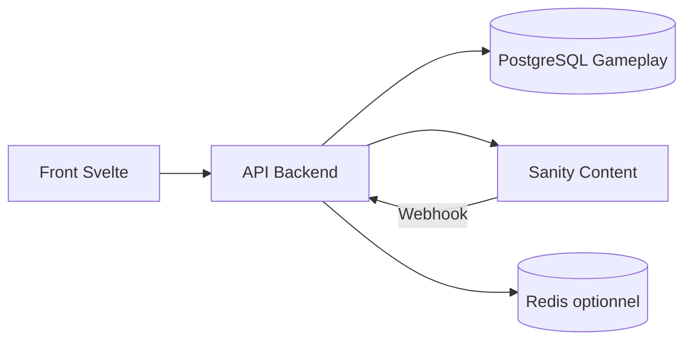

# Mastermind OS - Logique metier et architecture data

## 1. Decision architecture

Sanity est retenu pour la couche contenu et live ops.
Une base transactionnelle est retenue pour le gameplay.

1. Sanity
- Contenus editables: modes, textes UI, saisons, challenges, rewards, regles configurables.
- Publication et versioning du contenu.
- Usage back-office par l equipe produit.

2. Base transactionnelle (PostgreSQL recommande)
- Etats de partie, tours, guesses, economy, progression.
- Contraintes d integrite, transactions, index, audit.
- Source de verite gameplay.

3. Backend API
- Applique toutes les regles metier.
- Expose des endpoints au front.
- Lit Sanity pour le contenu publie et Postgres pour le runtime.

## 2. Decoupage des domaines metier

1. Identity
- Joueur, profil, auth, device.

2. Catalog
- Definition des modes de jeu et parametres actifs (depuis Sanity).

3. Matchmaking
- Creation d une partie selon mode et regles.

4. Gameplay
- Etat de partie, tours, validation des guesses, feedback Mastermind.

5. Economy
- Credits, couts d indices, rewards, ledger transactionnel.

6. Progression
- Rang, elo/mmr, stats, saison.

## 3. Etat et transitions d une partie

Etats recommandés:
- draft
- waiting_opponent
- active
- waiting_turn
- completed
- canceled
- expired

Regles:
1. Une partie est creee en draft ou waiting_opponent.
2. Quand les conditions de demarrage sont remplies, elle passe en active.
3. Le tour alterne via waiting_turn selon le mode.
4. A victoire, abandon, timeout, elle passe en completed, canceled ou expired.
5. Une partie fermee ne peut plus accepter de move.

## 4. Entites transactionnelles (Postgres)

## 4.1 users
- id (uuid)
- display_name
- created_at
- status

## 4.2 game_modes_runtime
- id (uuid)
- code (unique)
- rules_version
- is_enabled
- source_sanity_doc_id

Note: table cache runtime derivee de Sanity, synchronisee via job ou webhook.

## 4.3 matches
- id (uuid)
- mode_id (fk)
- state
- created_by_user_id (fk)
- current_turn_user_id (fk nullable)
- secret_code_hash
- max_turns
- turn_number
- started_at
- ended_at
- winner_user_id (fk nullable)
- created_at
- updated_at

## 4.4 match_players
- match_id (fk)
- user_id (fk)
- seat (smallint)
- is_ready
- joined_at
Primary key: (match_id, user_id)
Unique: (match_id, seat)

## 4.5 match_turns
- id (uuid)
- match_id (fk)
- turn_index
- actor_user_id (fk)
- status
- started_at
- submitted_at
Unique: (match_id, turn_index)

## 4.6 guesses
- id (uuid)
- match_id (fk)
- turn_id (fk)
- actor_user_id (fk)
- payload_json
- exact_hits
- partial_hits
- is_win
- created_at

## 4.7 economy_ledger
- id (uuid)
- user_id (fk)
- match_id (fk nullable)
- type (debit_credit_reward_refund)
- amount
- currency_code
- reason
- created_at

## 4.8 ranking_snapshots
- id (uuid)
- user_id (fk)
- season_id
- rating
- rank_tier
- wins
- losses
- updated_at

## 5. Contenu Sanity propose

Types principaux:
1. gameModeContent
- slug
- title
- shortDescription
- icon
- isVisible
- displayOrder
- ctaLabel

2. gameRuleSet
- modeSlug
- maxTurns
- symbols
- hintPolicy
- timeoutSeconds
- economyCosts
- releaseTag

3. challengeDaily
- challengeDate
- title
- description
- rewardCredits
- difficulty
- activeFrom
- activeTo

4. liveOpsBanner
- title
- body
- ctaLabel
- ctaRoute
- priority
- publishedWindow

5. seasonConfig
- seasonCode
- startsAt
- endsAt
- rewardTable
- rankLabels

Principe:
- Sanity stocke le declaratif.
- Le backend compile ce declaratif vers runtime en DB.

## 6. Endpoints API MVP (10)

1. POST /v1/matches
- Cree une partie selon mode.

2. GET /v1/matches
- Liste des parties du joueur connecte.

3. GET /v1/matches/:matchId
- Detail d une partie.

4. POST /v1/matches/:matchId/join
- Rejoindre une partie.

5. POST /v1/matches/:matchId/start
- Demarrer la partie si preconditions valides.

6. POST /v1/matches/:matchId/guess
- Soumettre un guess pour le tour courant.

7. POST /v1/matches/:matchId/forfeit
- Abandon de partie.

8. GET /v1/catalog/modes
- Catalogue des modes publies (depuis Sanity).

9. GET /v1/challenges/daily
- Defi quotidien publie.

10. GET /v1/profile/overview
- Credits, stats, rang, resume.

## 7. Regles metier critiques

1. Verrouillage concurrence
- Un seul guess valide par tour et par acteur.

2. Idempotence
- Toutes les actions critiques acceptent un idempotency key.

3. Integrite economy
- Toute variation de credits passe par economy_ledger.

4. Validation serveur
- Le serveur valide les guesses et calcule le feedback.

5. Horodatage autoritaire
- Le serveur est source du temps (pas le client).

## 8. Flux de donnees recommandé

1. Front charge lobby
- GET profile/overview
- GET matches
- GET challenges/daily

2. Front charge modes
- GET catalog/modes

3. Front joue un tour
- GET match detail
- POST guess
- GET match detail (refresh)

4. Back-office publie un mode
- Edition Sanity
- Webhook Sanity vers backend
- Sync vers game_modes_runtime

## 9. Plan d implementation en 3 sprints

Sprint 1
1. Schema Postgres + migrations initiales.
2. Endpoint matches list/detail/create.
3. Endpoint catalog/modes branche Sanity.

Sprint 2
1. Endpoint guess avec validation serveur.
2. Machine d etat match et transitions.
3. Ledger credits de base.

Sprint 3
1. Daily challenge via Sanity.
2. Ranking snapshots.
3. Hardening prod: idempotence, rate limit, audit.

## 10. Conclusion

Oui, Sanity fonctionne tres bien dans ce projet si son role est clairement delimite:
- Sanity pour le contenu et les operations live.
- Postgres pour le gameplay transactionnel et la verite metier.

## 11. Schema d architecture

